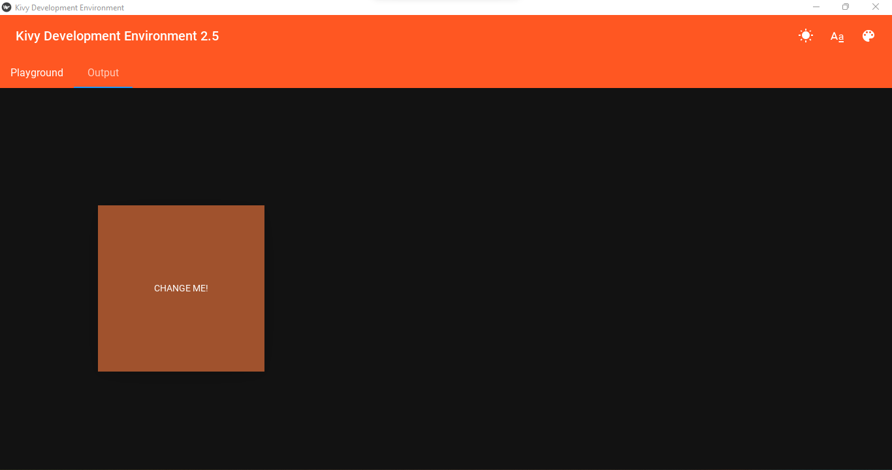

# **Kivy Development Environment 2.5**


## **Features & Screenshots 🧪**

- **Instantaneous Update 🚀**

- Visualize the correct size, color, font, position and elevation required for your project (Shows for only a button but can be visualized with other widgets as well) 👑

- Add tooltips and customize them to your liking (radius, background color, text color, text & font style 🎆

- Supports hexadecimal, template colors & theme colors 🎨

- Customize the interface by changing the theme, the primary color & the accent color 💮




## **Installing Kivy Development Environment**

### Downloading Executable (Recommended for Windows)

Requirements: [Git](https://git-scm.com/downloads)

```zsh
> git clone https://github.com/PenguinProMax5G/Kivy-Development-Environment

> cd Kivy-Development-Environment

> cd platforms/windows/dist

> KivyDevelopmentEnvironment.exe

```

### Downloading by Installing Dependencies (Recommended for MacOS & Linux)

Requirements: [Git](https://git-scm.com/downloads), [Python 3.9](https://www.python.org/downloads/release/python-390/), [Kivy](https://kivy.org/doc/stable/gettingstarted/installation.html), [KivyMD](https://kivymd.readthedocs.io/en/0.104.2/getting-started/)

```zsh
> pip install virtualenv

> virtualenv env

> source env/bin/activate

> git clone https://github.com/PenguinProMax5G/Kivy-Development-Environment

> cd Kivy-Development-Environment

> pip install -r requirements.txt

> python main.py
```

## **Documentation**

### **Theme Colors**

| **Theme Colors** | **Output** |
|:---|:---|
| primary_color | app.theme_cls.primary_color |
| primary_dark | app.theme_cls.primary_dark |
| accent_light | app.theme_cls.accent_light |
| accent_color | app.theme_cls.accent_color |
| accent_dark | app.theme_cls.accent_dark |
| bg_normal | app.theme_cls.bg_normal |
| bg_dark | app.theme_cls.bg_dark |
| bg_darkest | app.theme_cls.bg_darkest |
| bg_light | app.theme_cls.bg_light |
| opposite_bg_dark   | app.theme_cls.opposite_bg_dark  |
| opposite_bg_darkest  | app.theme_cls.opposite_bg_darkest  |
| opposite_bg_normal | app.theme_cls.opposite_bg_normal |
| opposite_bg_light | app.theme_cls.opposite_bg_light |
| error_color | app.theme_cls.error_color |

### **Template Colors**

| name                 | hex     | rgb                | families.0 | families.1 | families.2 | families.3 | families.4 |
| -------------------- | ------- | ------------------ | ---------- | ---------- | ---------- | ---------- | ---------- |
| INDIANRED            | #CD5C5C | RGB(205, 92, 92)   | red        | brown      |            |            |            |
| LIGHTCORAL           | #F08080 | RGB(240, 128, 128) | red        | pink       | coral      | light      |            |
| SALMON               | #FA8072 | RGB(250, 128, 114) | red        | pink       | orange     | salmon     |            |
| DARKSALMON           | #E9967A | RGB(233, 150, 122) | red        | pink       | orange     | salmon     | dark       |
| LIGHTSALMON          | #FFA07A | RGB(255, 160, 122) | red        | pink       | orange     | salmon     | light      |
| CRIMSON              | #DC143C | RGB(220, 20, 60)   | red        |            |            |            |            |
| RED                  | #FF0000 | RGB(255, 0, 0)     | red        |            |            |            |            |
| DARKRED              | #8B0000 | RGB(139, 0, 0)     | red        | dark       |            |            |            |
| PINK                 | #FFC0CB | RGB(255, 192, 203) | pink       |            |            |            |            |
| LIGHTPINK            | #FFB6C1 | RGB(255, 182, 193) | pink       | light      |            |            |            |
| HOTPINK              | #FF69B4 | RGB(255, 105, 180) | pink       | hot        |            |            |            |
| DEEPPINK             | #FF1493 | RGB(255, 20, 147)  | pink       | deep       |            |            |            |
| MEDIUMVIOLETRED      | #C71585 | RGB(199, 21, 133)  | pink       | purple     | violet     | medium     |            |
| PALEVIOLETRED        | #DB7093 | RGB(219, 112, 147) | pink       | pale       | violet     |            |            |
| CORAL                | #FF7F50 | RGB(255, 127, 80)  | orange     | coral      |            |            |            |
| TOMATO               | #FF6347 | RGB(255, 99, 71    | orange     | red        |            |            |            |
| ORANGERED            | #FF4500 | RGB(255, 69, 0)    | orange     | red        |            |            |            |
| DARKORANGE           | #FF8C00 | RGB(255, 140, 0)   | orange     | dark       |            |            |            |
| ORANGE               | #FFA500 | RGB(255, 165, 0)   | orange     |            |            |            |            |
| GOLD                 | #FFD700 | RGB(255, 215, 0)   | yellow     |            |            |            |            |
| YELLOW               | #FFFF00 | RGB(255, 255, 0)   | yellow     |            |            |            |            |
| LIGHTYELLOW          | #FFFFE0 | RGB(255, 255, 224) | yellow     | light      |            |            |            |
| LEMONCHIFFON         | #FFFACD | RGB(255, 250, 205) | yellow     | lemon      |            |            |            |
| LIGHTGOLDENRODYELLOW | #FAFAD2 | RGB(250, 250, 210) | yellow     | light      | goldenrod  | tan        |            |
| PAPAYAWHIP           | #FFEFD5 | RGB(255, 239, 213) | pink       | tan        |            |            |            |
| MOCCASIN             | #FFE4B5 | RGB(255, 228, 181) | pink       | tan        |            |            |            |
| PEACHPUFF            | #FFDAB9 | RGB(255, 218, 185) | pink       | orange     | peach      |            |            |
| PALEGOLDENROD        | #EEE8AA | RGB(238, 232, 170) | yellow     | tan        | pale       | goldenrod  |            |
| KHAKI                | #F0E68C | RGB(240, 230, 140) | yellow     | tan        | khaki      |            |            |
| DARKKHAKI            | #BDB76B | RGB(189, 183, 107) | yellow     | tan        | khaki      | dark       |            |
| LAVENDER             | #E6E6FA | RGB(230, 230, 250) | purple     |            |            |            |            |
| THISTLE              | #D8BFD8 | RGB(216, 191, 216) | purple     |            |            |            |            |
| PLUM                 | #DDA0DD | RGB(221, 160, 221) | purple     |            |            |            |            |
| VIOLET               | #EE82EE | RGB(238, 130, 238) | purple     | violet     | pink       |            |            |
| ORCHID               | #DA70D6 | RGB(218, 112, 214) | purple     | orchid     |            |            |            |
| FUCHSIA              | #FF00FF | RGB(255, 0, 255)   | purple     | pink       |            |            |            |
| MAGENTA              | #FF00FF | RGB(255, 0, 255)   | purple     | pink       | magenta    |            |            |
| MEDIUMORCHID         | #BA55D3 | RGB(186, 85, 211)  | purple     | orchid     | medium     |            |            |
| MEDIUMPURPLE         | #9370DB | RGB(147, 112, 219) | purple     | medium     |            |            |            |
| REBECCAPURPLE        | #663399 | RGB(102, 51, 153)  | purple     | blue       |            |            |            |
| BLUEVIOLET           | #8A2BE2 | RGB(138, 43, 226)  | purple     | blue       | violet     |            |            |
| DARKVIOLET           | #9400D3 | RGB(148, 0, 211)   | purple     | dark       | violet     |            |            |
| DARKORCHID           | #9932CC | RGB(153, 50, 204)  | purple     | dark       | orchid     |            |            |
| DARKMAGENTA          | #8B008B | RGB(139, 0, 139)   | purple     | dark       | magenta    |            |            |
| PURPLE               | #800080 | RGB(128, 0, 128)   | purple     |            |            |            |            |
| INDIGO               | #4B0082 | RGB(75, 0, 130)    | purple     | blue       |            |            |            |
| SLATEBLUE            | #6A5ACD | RGB(106, 90, 205)  | purple     | blue       | slate      |            |            |
| DARKSLATEBLUE        | #483D8B | RGB(72, 61, 139)   | purple     | blue       | slate      | dark       |            |
| MEDIUMSLATEBLUE      | #7B68EE | RGB(123, 104, 238) | purple     | blue       | slate      | medium     |            |
| GREENYELLOW          | #ADFF2F | RGB(173, 255, 47)  | green      | yellow     |            |            |            |
| CHARTREUSE           | #7FFF00 | RGB(127, 255, 0)   | green      |            |            |            |            |
| LAWNGREEN            | #7CFC00 | RGB(124, 252, 0)   | green      |            |            |            |            |
| LIME                 | #00FF00 | RGB(0, 255, 0)     | green      |            |            |            |            |
| LIMEGREEN            | #32CD32 | RGB(50, 205, 50)   | green      |            |            |            |            |
| PALEGREEN            | #98FB98 | RGB(152, 251, 152) | green      | pale       |            |            |            |
| LIGHTGREEN           | #90EE90 | RGB(144, 238, 144) | green      | light      |            |            |            |
| MEDIUMSPRINGGREEN    | #00FA9A | RGB(0, 250, 154)   | green      | medium     | spring     |            |            |
| SPRINGGREEN          | #00FF7F | RGB(0, 255, 127)   | green      | spring     |            |            |            |
| MEDIUMSEAGREEN       | #3CB371 | RGB(60, 179, 113)  | green      | sea        | medium     |            |            |
| SEAGREEN             | #2E8B57 | RGB(46, 139, 87)   | green      | sea        |            |            |            |
| FORESTGREEN          | #228B22 | RGB(34, 139, 34)   | green      | forest     |            |            |            |
| GREEN                | #008000 | RGB(0, 128, 0)     | green      |            |            |            |            |
| DARKGREEN            | #006400 | RGB(0, 100, 0)     | green      | dark       |            |            |            |
| YELLOWGREEN          | #9ACD32 | RGB(154, 205, 50)  | green      | yellow     |            |            |            |
| OLIVEDRAB            | #6B8E23 | RGB(107, 142, 35)  | green      | olive      |            |            |            |
| OLIVE                | #6B8E23 | RGB(128, 128, 0)   | green      | olive      |            |            |            |
| DARKOLIVEGREEN       | #556B2F | RGB(85, 107, 47)   | green      | olive      | dark       |            |            |
| MEDIUMAQUAMARINE     | #66CDAA | RGB(102, 205, 170) | green      | blue       | aquamarine | medium     |            |
| DARKSEAGREEN         | #8FBC8B | RGB(143, 188, 139) | green      | sea        | dark       |            |            |
| LIGHTSEAGREEN        | #20B2AA | RGB(32, 178, 170)  | green      | blue       | sea        | light      |            |
| DARKCYAN             | #008B8B | RGB(0, 139, 139)   | green      | blue       | cyan       | dark       |            |
| TEAL                 | #008080 | RGB(0, 128, 128)   | green      | blue       |            |            |            |
| AQUA                 | #00FFFF | RGB(0, 255, 255)   | blue       | aqua       |            |            |            |
| CYAN                 | #00FFFF | RGB(0, 255, 255)   | blue       | cyan       |            |            |            |
| LIGHTCYAN            | #E0FFFF | RGB(224, 255, 255) | blue       | cyan       | light      |            |            |
| PALETURQUOISE        | #AFEEEE | RGB(175, 238, 238) | blue       | turquoise  | pale       |            |            |
| AQUAMARINE           | #7FFFD4 | RGB(127, 255, 212) | blue       | aquamarine |            |            |            |
| TURQUOISE            | #40E0D0 | RGB(64, 224, 208)  | blue       | turquoise  |            |            |            |
| MEDIUMTURQUOISE      | #48D1CC | RGB(72, 209, 204)  | blue       | turquoise  | medium     |            |            |
| DARKTURQUOISE        | #00CED1 | RGB(0, 206, 209)   | blue       | turquoise  | dark       |            |            |
| CADETBLUE            | #5F9EA0 | RGB(95, 158, 160)  | blue       | gray       |            |            |            |
| STEELBLUE            | #4682B4 | RGB(70, 130, 180)  | blue       | steel      |            |            |            |
| LIGHTSTEELBLUE       | #B0C4DE | RGB(176, 196, 222) | blue       | steel      | light      |            |            |
| POWDERBLUE           | #B0E0E6 | RGB(176, 224, 230) | blue       |            |            |            |            |
| LIGHTBLUE            | #ADD8E6 | RGB(173, 216, 230) | blue       | light      |            |            |            |
| SKYBLUE              | #87CEEB | RGB(135, 206, 235) | blue       | sky        |            |            |            |
| LIGHTSKYBLUE         | #87CEFA | RGB(135, 206, 250) | blue       | sky        | light      |            |            |
| DEEPSKYBLUE          | #00BFFF | RGB(0, 191, 255)   | blue       | sky        | deep       |            |            |
| DODGERBLUE           | #1E90FF | RGB(30, 144, 255)  | blue       |            |            |            |            |
| CORNFLOWERBLUE       | #6495ED | RGB(100, 149, 237) | blue       |            |            |            |            |
| ROYALBLUE            | #4169E1 | RGB(65, 105, 225)  | blue       |            |            |            |            |
| BLUE                 | #0000FF | RGB(0, 0, 255)     | blue       |            |            |            |            |
| MEDIUMBLUE           | #0000CD | RGB(0, 0, 205)     | blue       | medium     |            |            |            |
| DARKBLUE             | #00008B | RGB(0, 0, 139)     | blue       | dark       |            |            |            |
| NAVY                 | #00008B | RGB(0, 0, 128)     | blue       | dark       |            |            |            |
| MIDNIGHTBLUE         | #191970 | RGB(25, 25, 112))  | blue       | dark       |            |            |            |
| CORNSILK             | #FFF8DC | RGB(255, 248, 220) | brown      | tan        |            |            |            |
| BLANCHEDALMOND       | #FFEBCD | RGB(255, 235, 205) | brown      | tan        |            |            |            |
| BISQUE               | #FFE4C4 | RGB(255, 228, 196) | brown      | tan        |            |            |            |
| NAVAJOWHITE          | #FFDEAD | RGB(255, 222, 173) | brown      | tan        |            |            |            |
| WHEAT                | #F5DEB3 | RGB(245, 222, 179) | brown      | tan        |            |            |            |
| BURLYWOOD            | #DEB887 | RGB(222, 184, 135) | brown      | tan        |            |            |            |
| TAN                  | #D2B48C | RGB(210, 180, 140) | brown      | tan        |            |            |            |
| ROSYBROWN            | #BC8F8F | RGB(188, 143, 143) | brown      | tan        |            |            |            |
| SANDYBROWN           | #F4A460 | RGB(244, 164, 96)  | brown      | orange     |            |            |            |
| GOLDENROD            | #DAA520 | RGB(218, 165, 32)  | brown      | goldenrod  | orange     |            |            |
| DARKGOLDENROD        | #B8860B | RGB(184, 134, 11)  | brown      | orange     | goldenrod  | dark       |            |
| PERU                 | #CD853F | RGB(205, 133, 63)  | brown      | orange     |            |            |            |
| CHOCOLATE            | #D2691E | RGB(210, 105, 30)  | brown      | orange     |            |            |            |
| SADDLEBROWN          | #8B4513 | RGB(139, 69, 19)   | brown      |            |            |            |            |
| SIENNA               | #A0522D | RGB(160, 82, 45)   | brown      |            |            |            |            |
| BROWN                | #A52A2A | RGB(165, 42, 42)   | brown      | red        |            |            |            |
| MAROON               | #800000 | RGB(128, 0, 0)     | brown      | red        |            |            |            |
| WHITE                | #FFFFFF | RGB(255, 255, 255) | white      |            |            |            |            |
| SNOW                 | #FFFAFA | RGB(255, 250, 250) | white      |            |            |            |            |
| HONEYDEW             | #F0FFF0 | RGB(240, 255, 240) | white      |            |            |            |            |
| MINTCREAM            | #F5FFFA | RGB(245, 255, 250) | white      |            |            |            |            |
| AZURE                | #F0FFFF | RGB(240, 255, 255) | white      |            |            |            |            |
| ALICEBLUE            | #F0F8FF | RGB(240, 248, 255) | white      |            |            |            |            |
| GHOSTWHITE           | #F8F8FF | RGB(248, 248, 255) | white      |            |            |            |            |
| WHITESMOKE           | #F5F5F5 | RGB(245, 245, 245) | white      |            |            |            |            |
| SEASHELL             | #FFF5EE | RGB(255, 245, 238) | white      | pink       |            |            |            |
| BEIGE                | #F5F5DC | RGB(245, 245, 220) | white      | tan        |            |            |            |
| OLDLACE              | #FDF5E6 | RGB(253, 245, 230) | white      | tan        |            |            |            |
| FLORALWHITE          | #FDF5E6 | RGB(253, 245, 230) | white      | tan        |            |            |            |
| IVORY                | #FFFFF0 | RGB(255, 255, 240) | white      | tan        |            |            |            |
| ANTIQUEWHITE         | #FAEBD7 | RGB(250, 235, 215) | white      | tan        |            |            |            |
| LINEN                | #FAF0E6 | RGB(250, 240, 230) | white      | tan        |            |            |            |
| LAVENDERBLUSH        | #FFF0F5 | RGB(255, 240, 245) | white      | lavender   | pink       |            |            |
| MISTYROSE            | #FFE4E1 | RGB(255, 228, 225) | white      | pink       |            |            |            |
| GAINSBORO            | #DCDCDC | RGB(220, 220, 220) | gray       |            |            |            |            |
| LIGHTGRAY            | #D3D3D3 | RGB(211, 211, 211) | gray       | light      |            |            |            |
| SILVER               | #C0C0C0 | RGB(192, 192, 192) | gray       |            |            |            |            |
| DARKGRAY             | #A9A9A9 | RGB(169, 169, 169) | gray       | dark       |            |            |            |
| GRAY                 | #808080 | RGB(128, 128, 128) | gray       |            |            |            |            |
| DIMGRAY              | #696969 | RGB(105, 105, 105) | gray       |            |            |            |            |
| LIGHTSLATEGRAY       | #778899 | RGB(119, 136, 153) | gray       | light      | slate      |            |            |
| SLATEGRAY            | #708090 | RGB(112, 128, 144) | gray       | slate      |            |            |            |
| DARKSLATEGRAY        | #2F4F4F | RGB(47, 79, 79)    | gray       | slate      | dark       |            |            |
| BLACK                | #000000 | RGB(0, 0, 0)       | black      |            |            |            |            |